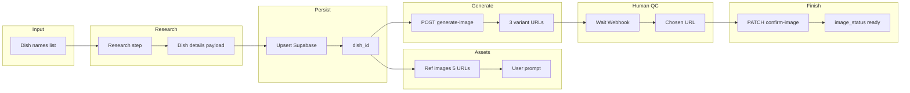

# Combined n8n workflow: Dish research → population → photo generation

Single automated workflow: **research dish details** → **upsert to Supabase** → **reference images + user prompt** → **generate 3 variants** → **human QC** → **upload to R2 & update dish**. You run n8n; the app exposes API endpoints so secrets (Nano Banana, R2, Supabase service role) stay in the app.

---

## 1. Flow overview



**High-level steps**

| # | Step | Owner | Output |
|---|------|--------|--------|
| 1 | Trigger + input dish names | n8n | List of dish names (e.g. from Sheet, CSV, or static list) |
| 2 | Research dish details | n8n (LLM + optional search) | One **Dish details payload** per name (§2) |
| 3 | Upsert to Supabase | n8n → Supabase | `dish_id`, `slug` per dish (§3) |
| 4 | Get reference image URLs | n8n (search or stored) | **ref_image_urls** (3–5 URLs) per dish (§4) |
| 5 | Build user prompt | n8n (LLM or template) | **user_prompt** (1–3 sentences) per dish (§5) |
| 6 | Generate image variants | n8n → App API | **variant_urls** (3 URLs) per dish (§6) |
| 7 | Human QC | n8n Wait / Webhook | **chosen_image_url** (or variant index) (§7) |
| 8 | Confirm image & publish | n8n → App API | `image_url`, `image_status = 'ready'` (§8) |

---

## 2. Required output: Dish details (research step)

Research (LLM with Vietnamese recipe/source context, or scraped + LLM extraction) must produce **one object per dish** that the next step can send to Supabase. All fields below are the **required output** of the research step; n8n then maps them to the DB.

**Required / strongly recommended**

| Field | Type | Notes |
|-------|------|--------|
| `slug` | string | Unique, lowercase, hyphenated (e.g. `ca-kho-to`). Derive from `name_vi` if not provided. |
| `name_vi` | string | Display name (e.g. Cá Kho Tộ). |
| `dish_type` | enum | One of: `man`, `canh`, `rau`, `tinh_bot`, `khai_vi`, `trang_mieng`. |
| `category` | enum | One of: `soup`, `braise`, `stir_fry`, `steam`, `rice`, `fresh`. |
| `cook_time_minutes` | number \| null | Integer. |
| `budget_tier` | enum \| null | One of: `low`, `mid`, `high`. |
| `ingredients_required` | array | JSON array of `{ "tag": "thit_heo", "name_vi": "Thịt heo", "qty": 300, "unit": "g" }`. Tag: lowercase, no accent, underscore. |
| `ingredients_optional` | array | Same shape; optional/garnish. Can be `[]`. |
| `steps` | array | JSON array of `{ "order": 1, "description": "...", "timer_seconds": null \| number }`. |
| `region` | enum \| null | One of: `north`, `central`, `south`, `nationwide`. |

**Optional (health/nutrition — research if possible, else null)**

| Field | Type | Notes |
|-------|------|--------|
| `prep_time_minutes` | number \| null | |
| `calories` | number \| null | |
| `protein_g`, `carb_g`, `fat_g` | number \| null | |
| `sodium_mg` | number \| null | |
| `purine_level` | `low` \| `medium` \| `high` \| null | |
| `glycemic_index` | number \| null | |
| `sat_fat_level`, `added_sugar_level` | same enum \| null | |
| `potassium_level`, `phosphorus_level`, `fiber_level` | same enum \| null | |
| `suitable_conditions`, `unsafe_conditions`, `caution_conditions` | string[] | Condition slugs per tech-spec. |
| `tips` | string[] | Optional. |

**Fixed by workflow (do not research)**

- `image_status`: set to `'pending'` on insert.
- `image_url`, `image_generated_at`: leave null until confirm step.
- `is_published`: `false` until photo is confirmed (or set later in a separate step).

**Example research output (one item)**

```json
{
  "slug": "ca-kho-to",
  "name_vi": "Cá Kho Tộ",
  "dish_type": "man",
  "category": "braise",
  "cook_time_minutes": 35,
  "budget_tier": "mid",
  "ingredients_required": [
    { "tag": "ca_loc", "name_vi": "Cá lóc", "qty": 500, "unit": "g" },
    { "tag": "nuoc_mam", "name_vi": "Nước mắm", "qty": 2, "unit": "thìa" }
  ],
  "ingredients_optional": [],
  "steps": [
    { "order": 1, "description": "Cá làm sạch, cắt khúc.", "timer_seconds": null },
    { "order": 2, "description": "Kho với nước mắm, đường, nước màu đến khi thấm.", "timer_seconds": 1200 }
  ],
  "region": "south",
  "purine_level": "medium",
  "sodium_mg": 450
}
```

---

## 3. Required output: Upsert to Supabase

- **Action:** Insert or update `dishes` (use Supabase upsert on `slug` so re-runs don’t duplicate).
- **Input:** Each research payload from §2.
- **Required output (per item):**  
  `dish_id` (uuid), `slug`.  
  These are needed for: ref images (per dish), user prompt (per dish), and all subsequent API calls.

If the row already exists and has `image_status = 'ready'`, you may **skip** this dish in the photo steps (or only run research/upsert and skip photo for it).

---

## 4. Required output: Reference image URLs

- **Purpose:** 3–5 real food photo URLs for the image model (ingredient accuracy). See [food-photo-system-v1.1](docs/artifacts/food-photo-system-v1.1.html).
- **Options in n8n:**  
  - Image search node (e.g. SerpAPI, Google Custom Search) with query like `"[name_vi] nấu ăn"` or `"[name_vi] recipe"` → filter to 5 URLs (min 3).  
  - Or read from a Sheet/DB column per dish (ref_1 … ref_5) if you maintain them manually.
- **Required output (per dish):**  
  `ref_image_urls`: array of 3–5 strings (public image URLs).  
  Passed to the app in the generate step.

---

## 5. Required output: User prompt

- **Purpose:** 1–3 sentences: composition + garnish lock for the image model (Layer 3 in food-photo spec).
- **Options in n8n:**  
  - LLM node: “Viết 1–3 câu mô tả bố cục ảnh món [name_vi]: hero là gì, góc chụp, không mô tả nguyên liệu chi tiết (đã có reference).”  
  - Or template: `"Món [name_vi], đặt trong tô/nồi đất, góc 45°, có rau thơm trang trí."`
- **Required output (per dish):**  
  `user_prompt`: string (1–3 sentences).  
  Passed to the app in the generate step.

---

## 6. Required output: Generate image (App API)

- **Action:** n8n calls your app; app calls Nano Banana (or other) with system prompt + ref_urls + user_prompt, returns 3 variant URLs.
- **Endpoint:** `POST /api/admin/dish/:id/generate-image`  
  **Body:** `{ "ref_image_urls": string[], "user_prompt": string }`  
  **Response:** `{ "variant_urls": [ string, string, string ] }` (or `variant_ids` if app stores temp and returns ids).
- **Required output (per dish):**  
  `variant_urls` (or equivalent) so the human can pick one in the next step.

---

## 7. Required output: Human QC

- **Action:** n8n **Wait** node (resume from n8n UI) or **Webhook** node where a human submits the chosen image.
- **Required output (per dish):**  
  `chosen_image_url`: string (one of the 3 variant URLs), **or** `chosen_variant_index`: 0 | 1 | 2 (and app resolves to URL).  
  This is the only input for the confirm step.

---

## 8. Required output: Confirm image (App API)

- **Action:** n8n calls app; app downloads the chosen image (if URL), converts to WebP, uploads to R2 at `dishes/{dish_id}/hero.webp`, then updates DB.
- **Endpoint:** `PATCH /api/admin/dish/:id/confirm-image`  
  **Body:** `{ "image_url": string }` (the chosen variant URL) or `{ "variant_index": number }` if app stored variants.  
  **Response:** `{ "ok": true, "image_url": "https://..." }` (final CDN URL).
- **DB update (app side):**  
  `UPDATE dishes SET image_url = <cdn_url>, image_status = 'ready', image_generated_at = now() WHERE id = :id`.

Optional: set `is_published = true` in the same request or in a later batch (e.g. after dietitian_verified).

---

## 9. App API summary (what you need to implement)

| Method | Path | Body | Response |
|--------|------|------|----------|
| POST | `/api/admin/dish/:id/generate-image` | `{ "ref_image_urls": string[], "user_prompt": string }` | `{ "variant_urls": [ string, string, string ] }` |
| PATCH | `/api/admin/dish/:id/confirm-image` | `{ "image_url": string }` or `{ "variant_index": 0\|1\|2 }` | `{ "ok": true, "image_url": string }` |
| (existing) | `PATCH /api/admin/dish/:id/reset-image` | `{ "confirm": true }` | Reset to pending. |
| (existing) | `GET /api/admin/dishes/image-status` | — | `{ "pending", "generating", "ready", "failed": number }` |

Optional: `GET /api/admin/dishes?image_status=pending` returning list of `{ id, slug, name_vi }` so n8n can choose “only pending” when running only the photo part of the workflow.

---

## 10. n8n workflow structure (recommended)

1. **Trigger:** Manual or Schedule or Webhook (e.g. “new rows in Dish names Sheet”).
2. **Loop over dish names** (or over rows from Sheet).
3. **Research node(s):** LLM (and optionally search) → output **Dish details payload** (§2). Validate slug, dish_type, category enums.
4. **Supabase node:** Upsert `dishes` with payload; read back `id` (and `slug`) into the item.
5. **Branch or subflow “photo only if pending”:** optional filter `image_status !== 'ready'` (or run photo for all newly upserted).
6. **Ref images node:** Search or lookup → **ref_image_urls** (3–5).
7. **User prompt node:** LLM or template → **user_prompt**.
8. **HTTP Request:** `POST /api/admin/dish/{{ $json.dish_id }}/generate-image` with ref_image_urls + user_prompt. Store **variant_urls** in item.
9. **Wait or Webhook:** Pause until human sends **chosen_image_url** (or variant index). Attach to current dish_id.
10. **HTTP Request:** `PATCH /api/admin/dish/{{ $json.dish_id }}/confirm-image` with chosen image. Done for this dish.
11. **Next dish** (loop back or process next item).

Error handling: on generate or confirm failure, set `image_status = 'failed'` (via app or Supabase update) and optionally notify; n8n can retry or log and continue.

---

## 11. Optional: Store refs and prompt on dish

If you add columns (e.g. `reference_image_urls` jsonb, `photo_user_prompt` text) or a small table `dish_photo_assets(dish_id, ref_urls, user_prompt)`, then steps 4–5 can **read** from DB instead of recomputing refs/prompt every run. The research + upsert part can write these once; the photo part of the workflow only runs generate → QC → confirm.

---

This gives you the **correct flow** and **required output** at each step so you can build the single combined n8n workflow and the matching app endpoints.
